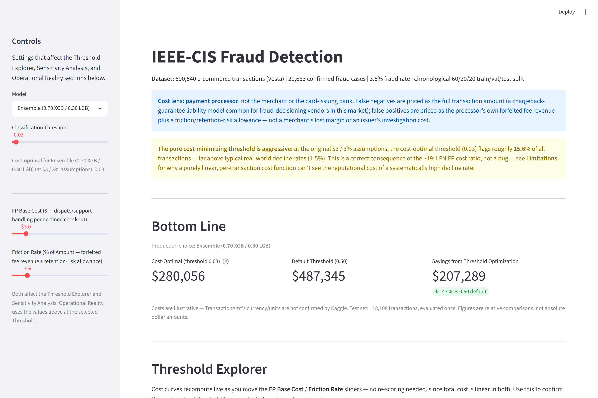
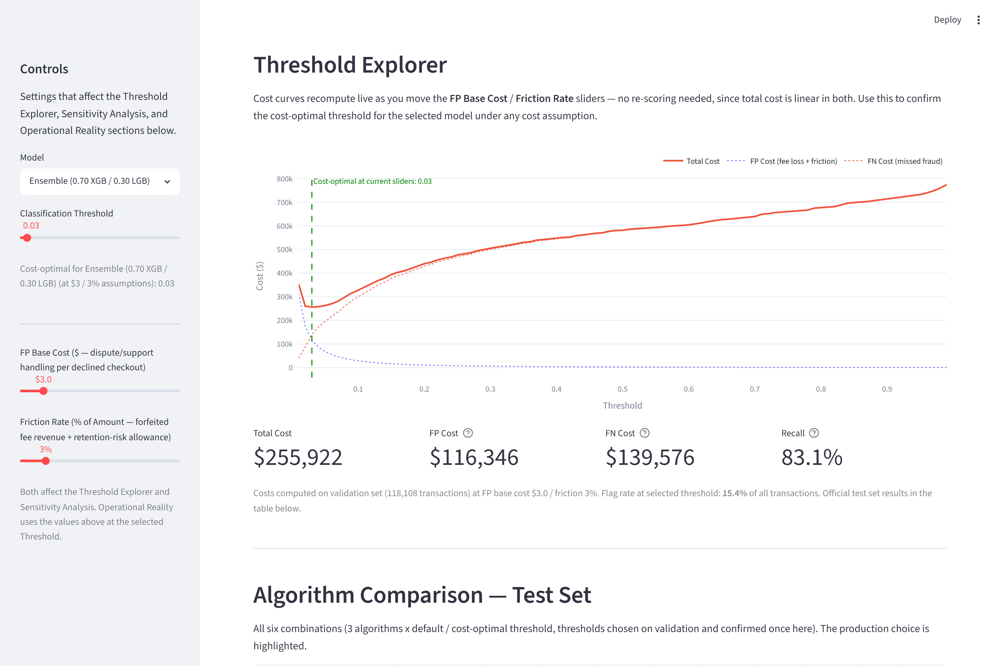
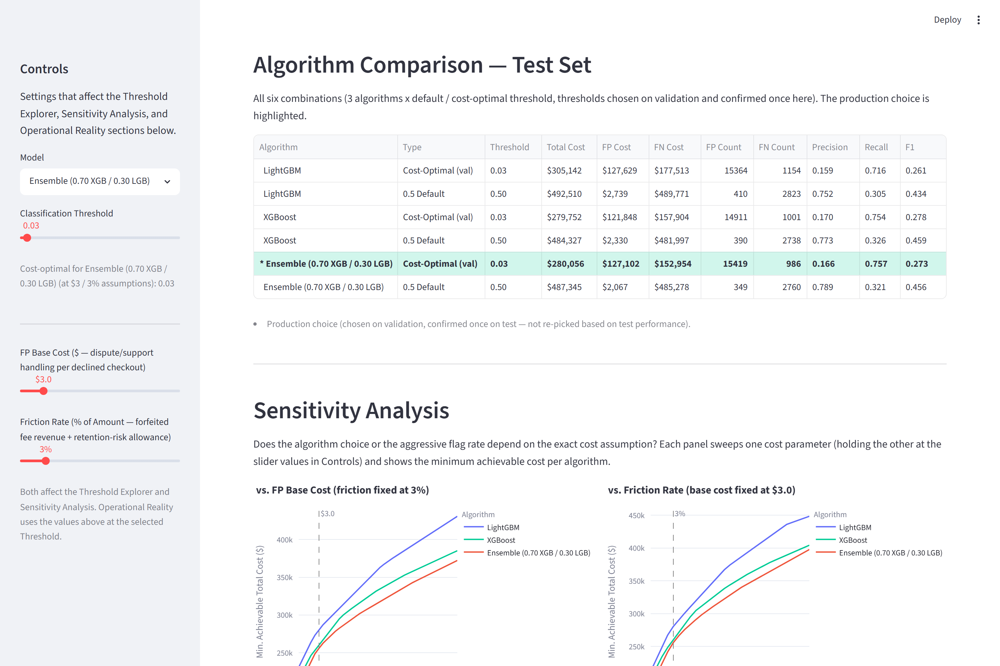
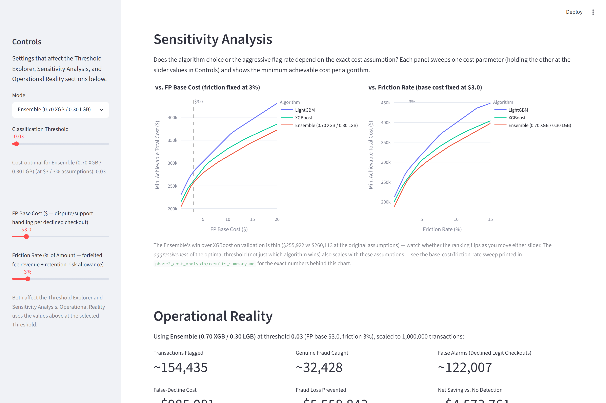
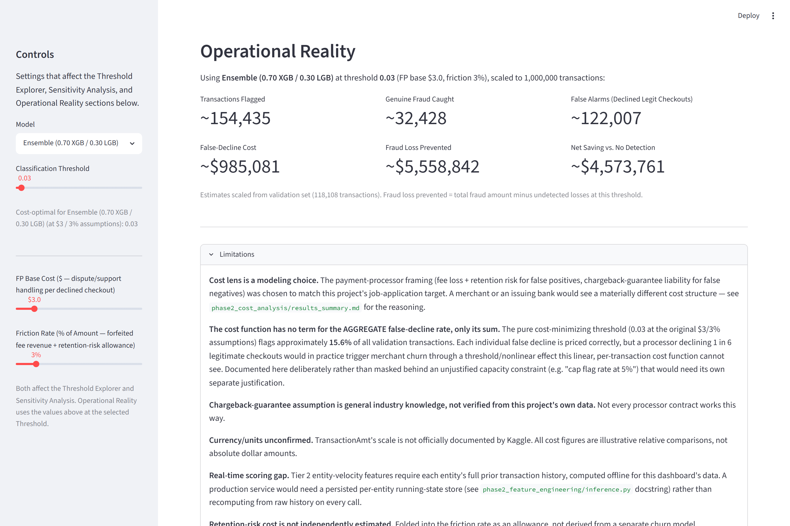

# IEEE-CIS Fraud Detection

## E-Commerce Fraud Detection + Payment-Processor Cost-Sensitive Decision Framework

---

## Overview

This project applies machine learning to the [Kaggle IEEE-CIS Fraud Detection](https://www.kaggle.com/c/ieee-fraud-detection)
dataset (590,540 e-commerce transactions from Vesta, a payment-services company; 20,663
confirmed fraud cases, 3.5% fraud rate) across three phases: a baseline detection
pipeline, feature engineering informed by the data's own structure, and a
cost-sensitive decision framework that translates model output into a business
recommendation.

It's a sequel to [`credit_card_fraud`](https://github.com/nharrison917/credit_card_fraud), a prior project
constrained by PCA-anonymized features that eliminated card identifiers and any
relational structure. This dataset preserves masked card/address fields, letting the
feature engineering go further: entity-level velocity features, a real segmentation
investigation, and a two-algorithm ensemble — all validated with controlled ablations
rather than taken on faith.

**The central finding is the same shape as the prior project's, for a different
reason:** here, the *cost function's own parameters* — not just the classification
threshold — determine whether the recommended operating point is realistic. The
payment-processor cost lens (see below) produces a cost-optimal threshold that flags
~15.6% of all transactions — mathematically correct given the assumptions, but far
more aggressive than real-world decline rates, and documented as a named limitation
rather than smoothed over.

> This project was developed using agentic AI ([Claude Code](https://claude.com/claude-code))
> as the analytical environment. Methodology decisions — the cost function's lens and
> parameter values, the entity-key fix for Tier 2 features, the segmentation and
> ensemble architecture, SMOTE ratio selection, and limitation framing — were directed
> by the author; the full decision log, including reversed decisions and dead ends, is
> in [`PLAN.md`](PLAN.md).

---

## Dataset

- **Source:** [Kaggle — IEEE-CIS Fraud Detection](https://www.kaggle.com/c/ieee-fraud-detection)
- 590,540 transactions over 182 days (~6 months), joined from `train_transaction.csv` +
  `train_identity.csv` (434 columns combined)
- 3.50% fraud rate (20,663 fraud cases)
- Only 24.4% of transactions have an identity record — a major driver of model
  behavior throughout this project (see Segmentation below)
- `TransactionDT` is seconds from an undisclosed reference point — relative
  periodicity (hour-of-day, day-of-week) is valid; absolute dates are not
- Split **chronologically** 60/20/20 (train/val/test) rather than randomly, to
  simulate real deployment: train on the past, evaluate on the future

---

## Dashboard

An interactive Streamlit dashboard surfaces the cost-sensitive decision framework —
model selector, live threshold and cost-parameter sliders, algorithm comparison,
sensitivity analysis, and an operational-reality panel scaled to 1,000,000
transactions.



**Threshold Explorer** — cost curves recompute live as the FP base cost / friction
rate sliders move, using a linear decomposition of the stored validation sweep (no
re-scoring the model). The cost-optimal threshold is marked directly on the chart.



**Algorithm Comparison** — all three algorithm choices (LightGBM, XGBoost, the
0.70/0.30 ensemble) at both their cost-optimal and default thresholds, confirmed once
on the test set.



**Sensitivity Analysis** — does the algorithm ranking or the aggressive flag rate
depend on the exact cost assumption? Two panels sweep FP base cost and friction rate
independently, each showing all three algorithms at once.



**Operational Reality** — the selected model and threshold translated into
transaction-level terms at 1,000,000-transaction scale, plus the full Limitations
section documenting the framework's own blind spots.



---

## Phase 1 — Baseline Detection

No feature engineering — establishes a clean before/after story. LightGBM and
XGBoost only: Random Forest was excluded (would need one-hot encoding of all
categoricals, an unfair comparison against LightGBM's native categorical handling);
Logistic Regression was excluded (structural `-999` sentinel missingness and
high-cardinality categoricals actively work against it).

| Model | Val ROC-AUC | Val PR-AUC |
|---|---|---|
| LightGBM (127 leaves) | 0.9125 | 0.5464 |
| XGBoost | 0.9170 | 0.5714 |

XGBoost wins Phase 1 despite LightGBM getting native categorical handling where
XGBoost got raw ordinal codes — the anonymized `V` columns (continuous Vesta
features) carry most of the signal here and suit XGBoost's numeric treatment.

**Missingness is structural, not random.** 339 `V` columns collapse to 10 distinct
missingness rates that map to Vesta's internal transaction sub-types (identity
verification pipeline vs. non-identity path vs. card-present-like transactions) —
confirmed via cross-correlation with identity presence, not assumed. This drove the
preprocessing strategy throughout: `-999` sentinels for trees to split on, not mean
imputation, and explicit `*_was_missing` flags where absence itself carries signal
(D-columns: "no prior event").

---

## Phase 2 — Feature Engineering

**Tier 1 (within-row, no leakage risk):** hour-of-day, day-of-week, a
timezone-corrected `local_hour` (using `id_14`'s offset — confirmed `TransactionDT` is
a single fixed reference point before trusting this), email-domain matching/free-email
flags, parsed browser/OS family. Validated with a controlled ablation
(`feature_fraction=1.0` to remove a real confound: LightGBM's column-subsampling seed
reshuffles its entire draw when the column count changes, making raw production-config
deltas untrustworthy below ~0.02 PR-AUC). Net effect: **+0.0074 PR-AUC (LightGBM),
+0.0040 (XGBoost)** — real but modest, since most signal already lives in the
anonymized `V` columns.

**Tier 2 (card-level velocity, the harder problem):** the first entity key tried
(`card1+card2+card3+card5`) looked promising until a validation check
(`transaction_day - D1` ≈ constant per real account) revealed it collapsed **~14
distinct real accounts per entity on average** — a masked-card-fragment collision
problem, not a velocity-feature problem. Fixed by adding a `D1`-adjusted start-day to
the entity key; a cohesion check (average distinct `addr1` per group) dropped from 3.9
to 0.94, consistent with genuine single accounts. With the corrected key: **XGBoost's
combined stack reached 0.9189 ROC-AUC / 0.5797 PR-AUC**, the best of the whole Phase 2
investigation — though feature-importance ranks for XGBoost stayed weak, so this is
documented as a real-but-unconfirmed win rather than an overclaimed one.

**Error analysis found a concrete, shared blind spot:** both algorithms are excellent
when identity/device data is present (98–99% of easy catches have it) and close to
blind without it — a direct consequence of the Phase 1 missingness finding, not a
missing feature. Higher-dollar and round-amount fraud is also disproportionately
missed by both models.

---

## Segmentation, SMOTE, and the Ensemble

**Segmentation** (`has_identity=1` vs. `=0`) was motivated directly by the error
analysis. A dedicated model for the `has_identity=1` segment won cleanly under the
pre-SMOTE config — but re-running the comparison after adopting SMOTE 1:10 and
hyperparameter tuning **reversed LightGBM's result** (its global model now beats its
own segment model) while XGBoost's segment model still won, by a smaller margin. The
architecture is now **algorithm-specific routing**, decided from re-tested evidence
each time the underlying config changed, not a single fixed rule.

**SMOTE 1:10 (via `SMOTENC`, not plain `SMOTE`** — which would corrupt one-hot and
binary engineered columns by linearly interpolating them) beat class-weighting alone
by a wide margin: **+0.056 PR-AUC (LightGBM), +0.027 (XGBoost)** — the largest single
gain in the project before the ensemble.

**A real bug, found by asking a step-back question.** Comparing LightGBM and XGBoost
by rank-percentile agreement (not just raw metrics) surfaced 10 legitimate
transactions where the two algorithms disagreed most: several were exact repeat
charges (a $37.34 subscription, three times) that LightGBM scored near-zero risk and
XGBoost scored 85–92nd percentile. Root cause: an entity-velocity feature
(`combo_amt_zscore`) divided by a prior standard deviation of exactly zero for
accounts with perfectly consistent history, producing `NaN` that the two algorithms'
native missing-value handling treated very differently. **Fix:** floor the prior std
at 1% of the prior mean instead of nulling on exact zero. Both production models were
retrained; XGBoost improved, LightGBM regressed slightly — consistent with the bug
having disproportionately confused XGBoost.

**The ensemble is the production default.** A 21-point weight sweep
(`w·xgb + (1−w)·lgb`, each already through its own routing) found **`w=0.70`** beats
standalone XGBoost by **+0.0086 PR-AUC (0.9320 ROC-AUC / 0.6265 PR-AUC)** — a broad
plateau (`w=0.55`–`0.85` all within 0.004), not a fragile single point, and confirmed
to hold in both `has_identity` segments separately, not just in aggregate.

---

## Phase 2 — Cost-Sensitive Decision Framework

### Why the cost function isn't reused from the prior project

The prior project used a generic issuer-investigation lens ($10 flat + 1% friction per
false positive). This project's job-application target is specifically a **payment
processor** — the merchant/issuer middleman — and the source data (Vesta) is itself
this kind of company, so the cost lens was rebuilt around a processor's own P&L:

```
FP cost = $3 + (3% × Amount)   # processor's forfeited fee revenue + a
                                # retention-risk allowance, not a merchant's
                                # lost margin or an issuer's investigation cost
FN cost = Amount                # a chargeback-guarantee liability model, common
                                # for fraud-decisioning vendors in this market
                                # (general industry knowledge, not verified from
                                # this project's own data)
```

An amount-distribution check against the prior project's dataset confirmed the
numeric *scale* transfers reasonably (comparable tails, though this dataset's median
transaction runs ~3x higher) — the framing, not the arithmetic, is what changed.

### Results

Threshold optimization + sensitivity analysis on validation, confirmed once on test,
across all three algorithm choices:

| Algorithm | Val cost-optimal threshold | Val total cost | Test total cost (same threshold) |
|---|---|---|
| LightGBM | 0.03 | $280,537 | $305,142 |
| XGBoost | 0.03 | $260,113 | $279,752 |
| **Ensemble (production)** | **0.03** | **$255,922** | $280,056 |

### The aggressive threshold, documented rather than hidden

The cost-optimal threshold (0.03) flags **~15.6% of all transactions** — far above
typical real-world decline rates (1–5%). This is a *correct* consequence of the
~19:1 FN:FP cost ratio under this lens, not a bug. But it exposes a real limitation:
the cost function prices each false decline correctly in isolation, with **no term
for the aggregate decline rate** — in practice, a processor declining 1 in 6
legitimate checkouts would trigger merchant churn through a threshold effect this
linear, per-transaction cost function can't see. Rather than mask this with an
unjustified capacity constraint ("cap flag rate at 5%") that would need its own
separate justification, it's named explicitly in the dashboard's Limitations section
and in `phase2_cost_analysis/results_summary.md`.

---

## Limitations

- **Cost lens is a modeling choice.** The payment-processor framing was chosen to
  match this project's job-application target; a merchant or an issuing bank would
  see a materially different cost structure.
- **Chargeback-guarantee assumption is general industry knowledge**, not verified
  from this project's own data — not every processor contract works this way.
- **The cost function has no term for the aggregate false-decline rate** — see above.
- **Currency/units unconfirmed.** `TransactionAmt`'s scale is not officially
  documented by Kaggle; all cost figures are illustrative relative comparisons.
- **Real-time scoring gap.** Tier 2 entity-velocity features need each entity's full
  prior transaction history, computed offline here. A production service would need a
  persisted per-entity running-state store rather than recomputing from raw history on
  every call — a real gap between this project's inference code and a deployable
  service (see `phase2_feature_engineering/inference.py`).
- **Shared model blind spot.** Both algorithms independently struggle on the same
  non-identity, `ProductCD=W` population — an information-limited segment, not a
  fixable modeling gap (confirmed by the segmentation investigation above).
- **V-column content is undisclosed.** Vesta's engineered features carry strong
  signal but are proprietary; this project does not claim to know what they encode.

---

## Project Structure

```
app.py                              Streamlit dashboard (run: streamlit run app.py)
PLAN.md                             Full methodology, decisions log, and session history

phase1_baseline/
    pipeline.py                     Baseline LightGBM/XGBoost pipeline
    eda*.py, eda*.html              EDA: missingness structure, amount/hour patterns

phase2_feature_engineering/
    feature_engineering.py          Tier 1 within-row features
    tier2_features.py               Tier 2 entity-velocity features (D1-adjusted key)
    tier2_triage.py, uid_validation.py   Entity-key validation and collision diagnosis
    segmented_pipeline.py, segment_analysis.py   has_identity segmentation
    smote_ablation.py               SMOTE ratio vs. class-weighting comparison
    hyperparameter_tuning.py        Randomized search on top of SMOTE 1:10
    model_divergence_analysis.py    Rank-agreement analysis; found the combo_amt_zscore bug
    ensemble_test.py                Weight sweep for the LightGBM/XGBoost blend
    inference.py                    Production HybridModel (algorithm-specific routing)
    finalize_production_models.py, finalize_tuned_models.py   Production artifact builds

phase2_cost_analysis/
    cost_threshold_analysis.py      Cost function, threshold sweep, sensitivity, test confirmation
    cost_report.html, results_summary.md   Stakeholder report and written summary

models/                             Metrics JSON (tracked); *.pkl / *.txt binaries (regenerate locally)
.claude/skills/run-ieee-fraud/       Project skill: launch + Playwright-verify the dashboard

data/                                Not tracked — see Dataset section above
```

---

## How to Run

```bash
# Create the conda environment
conda env create -f environment.yml
conda activate ieee-fraud

# Download the dataset from Kaggle and place these two files in data/:
#   train_transaction.csv, train_identity.csv

# Phase 1 — baseline detection
python phase1_baseline/pipeline.py

# Phase 2 — feature engineering, segmentation, ensemble
python phase2_feature_engineering/finalize_production_models.py
python phase2_feature_engineering/finalize_tuned_models.py

# Phase 2 — cost-sensitive analysis (also generates models/cost_dashboard_data.json)
python phase2_cost_analysis/cost_threshold_analysis.py

# Dashboard
streamlit run app.py
```

The dashboard requires `models/cost_dashboard_data.json` (generated by the cost
analysis script above); model `.pkl`/`.txt` binaries are not required to run it.

---

## Technologies

Python · pandas · LightGBM · XGBoost · imbalanced-learn (SMOTENC) · scikit-learn ·
Plotly · Streamlit
